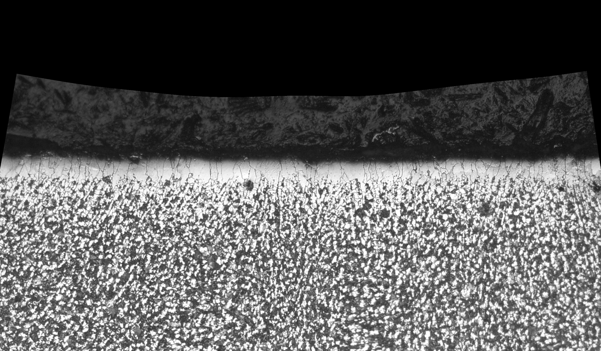
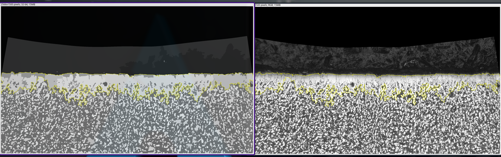
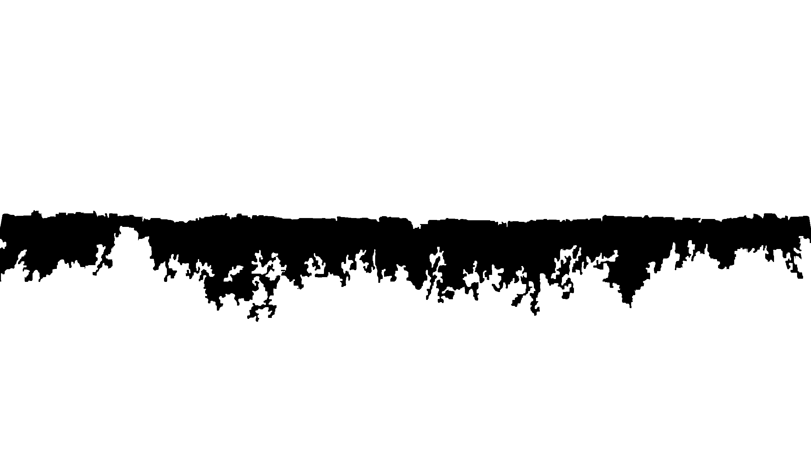
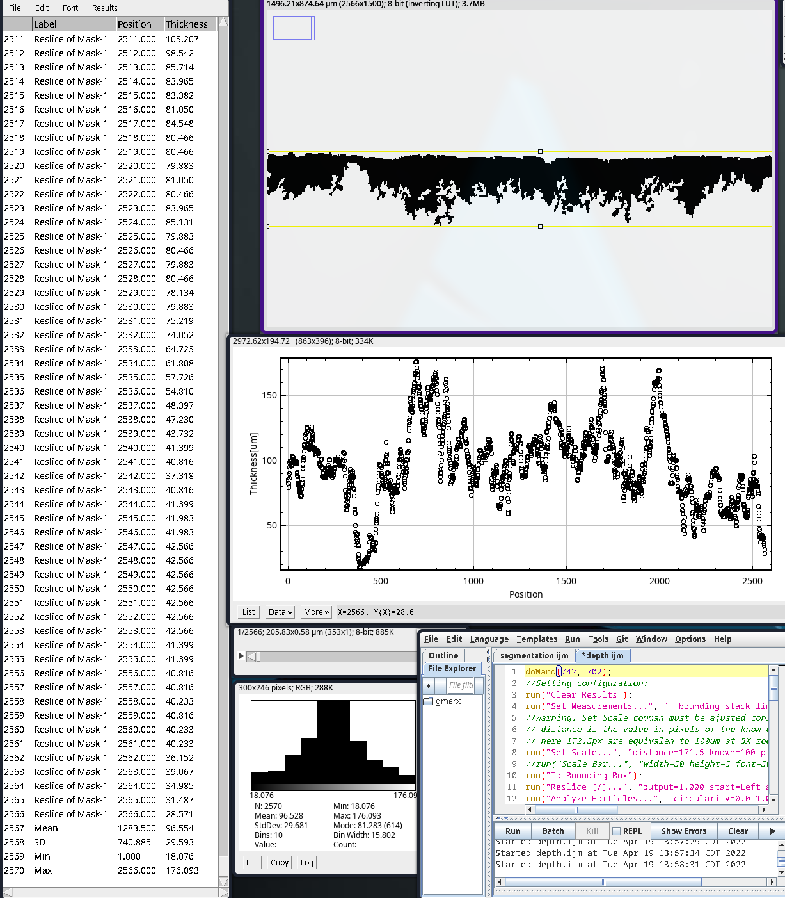

# Readme #

The present repository includes images, scripts and steps to process digital metallographs using the depth-measurements script for ImageJ. To run the scripts for each stage Image2 ver or Fiji ver are required. 

The next sections explain the general procedure to prepare images for measurements and a basic statistical analysis by using ImageJ commands and scripts.

# General procedure #
The procedure consists of three main stages: preprocess, segmentation and measurement; details are given in next section. The general aim is to prepare the metallographs to apply segmentation by the median filter and the statistical region merging ImageJ's tools. Finally, a basic script is run to measure the vertical depth measure over the resulting segmented zones. 

Thus, to follow this guide, the repository includes four metallographs from a AISI-1045 decarburized specimen. The images are:

  * `1a_1_5x_D.png`
  * `1a_2_5x_D.png`
  * `1a_3_5x_D.png`
  * `1a_4_5x_D.png`

  Below is shown the `1a_4_5x_D.png` image; *images include at the right-bottom side, the scale calibration rule*.


  # Preprocess stage #
  Open one of the included metallographs by pressing `Ctr-O` or click on `File -> Open` and select the file image. Then, in order to make reproducible steps follow the next series of small ImageJ scripts (macros) to follow and obtain the same results. First, open the preprocess macro by click on `Plugins -> Macros -> Run` and select the `preprocess.ijm` file. 

The contents if this macro is shown below: 

``` javascript
setTool("polyline");
run("Line Width...", "line=1500");
makeLine(4,440,324,388,572,360,756,342,1012,334,1268,340,1522,338,1734,354,1952,380,2150,402,2350,422,2556,450);
run("Straighten...");
```
the script enables the **segmented line** and define its line width at 1500 to cover a large region for the segmentation stage. The `makeLine` command, creates a segmented line with coordinates `(x1, y1, x2, y2, x3, y3, ..., xn, yn)`; each pair of coordinates will be connected to created a *n* segments line. Next,the `run("Straighten...");` command will apply the straighten process to create an horizontal image to apply the segmentation stage.

**Notice that this stage is not required if image is already prepared**. The resulting image is shown below:



# Segmentation stage # 
The segmentation applies the median filter and SRM process over the previous resulting image. In this example, the segmented zones are similar to the total decarburized zones.

**Notice that segmented zones selectivity depends on the values of r and Q; median filter and SRM.**

The contents of `segmentation.ijm` is listed below:

``` javascript
run("8-bit");
run("Median...", "radius=3");
run("Statistical Region Merging", "q=4 showaverages");
setKeyDown("shift");
//main zones selection
doWand(161, 721, 10.0, "8-connected");
doWand(269, 712, 10.0, "8-connected");
doWand(313, 750, 10.0, "8-connected");
doWand(505, 713, 10.0, "8-connected");
doWand(709, 716, 10.0, "8-connected");
doWand(752, 694, 10.0, "8-connected");
doWand(2400, 738, 10.0, "8-connected");
//upper limit zones selection
doWand(2464, 694, 10.0, "8-connected");
doWand(1493, 712, 10.0, "8-connected");
doWand(848, 692, 10.0, "8-connected");
doWand(1244, 692, 10.0, "8-connected");
doWand(1760, 702, 10.0, "8-connected");
doWand(2082, 702, 10.0, "8-connected");
doWand(2365, 698, 10.0, "8-connected");
doWand(1856, 698, 10.0, "8-connected");
setKeyDown("none");
run("Create Mask");
```

The `run("8-bit")` command converts the original image to gray-scale. Next, the `run("Median...", "radius=3")` applies the median filter with a window radius of 3 pixels. Then, the SRM is instructed by `run("Statistical Region Merging", "q=4 showaverages")` command; in this case a *Q* value of 4 is used. To learn about the selectivity of both, *r* and *Q* values, please refer to [^1]. The `showaverages` option allows to create statistically similar zones that enhance the selection in next steps.

Finally, the `Wand` tool is used to pick the regions of interest to measure. This can be done by manual pick (using the mouse), or as in this case, to make reproducible measurements by using code. The `doWand(161, 721, 10.0, "8-connected")` command is equivalent to click  with the mouse pointer at coordinates *(161, 721)*, with tolerance of 10 (about the picked intensity value), and the option `8-connected` considers the 8 neighbor pixels. 

Additionally, the `setKeyDown("shift")` and `run("Create Mask")` commands allow to pick multiple zones and add them to the final selection; similar to hold the `shift` key in ImageJ.

The resulting segmented zone (left, before apply the `Create Mask` command) and its comparison with the original image (right, straightened image) is shown next:



The final mask is shown next:



# Measurement stage #

This step gets the depth measurements on the Mask-image obtained previously. To apply properly this step, the input image must be a black and whit digital image, also a known distance is required to use as scale factor over the measurements conversion. This scale factor is commonly obtained from the original image's calibration rule; at the right-bottom side of the original micrograph. 

**In this particular case, the know distance is 100 micrometers and is equivalent to 171.5 pixels.**

The next script is the contents of `depth.ijm` file:

``` javascript
doWand(742, 702);
//-=-=-=-=-=-=-=-=-=
//Setting configuration:
run("Clear Results"); 
run("Set Measurements...", "  bounding stack limit display redirect=None decimal=3"); 
// Warning: Set Scale command must be adjusted considering:
// distance is the value in pixels of the know distance, 
// here 171.5px are equivalent to 100um at 5X zoom.
run("Set Scale...", "distance=171.5 known=100 pixel=1 unit=um"); 
// uncomment next line to show the scale bar: 
//run("Scale Bar...", "width=50 height=5 font=50 color=White background=Black location=[Lower Right] bold serif overlay label");
run("To Bounding Box"); 
run("Reslice [/]...", "output=1.000 start=Left avoid");  //use start=Top for Horizontal slices, and start=Left(vertical measurements)
run("Analyze Particles...", "circularity=0.0-1.00 show=Nothing display clear stack include in_situ"); 
//-=-=-=-=-=-=-=-=-=
//Measuring:
// Check slice number 
getDimensions(x,y,c,z,t); 
theWidth = newArray(z); 
name=getTitle(); 
//Width of each particle on slide
for (i=0;i<nResults;i++) { 
        tmpW = getResult("Width", i); 
        slice =  getResult("Slice", i); 
        theWidth[slice-1]+=tmpW*(1); 
} 
//Results:
Pos=newArray(z);
Thick=newArray(z);
run("Clear Results"); 
for (i=0;i<z;i++) { 
        setResult("Label", i, name); 
        setResult("Position", i, i+1); 
        Pos[i]=i+1;
        Thick[i]=theWidth[i];
        setResult("Thickness", i, theWidth[i]); 
}
//Plotting results:
run("Summarize");
meanThick=newArray(z);
//Distribution:
run("Distribution...","parameter=Thickness");
meanTemp=getResult("Thickness",(nResults-4));
for (i = 0; i < z; i++) {
  meanThick[i]=meanTemp;}
Plot.create("Fancier Plot", "Position", "Thickness[um]");
//Plot.setLimits(0, 5, 0, 3);
Plot.setLineWidth(1.4);
Plot.setColor("Black");
Plot.add("Circles", Pos, Thick);
Plot.setColor("red");
Plot.setLineWidth(1.7);
//Plot.add("line",meanThick)
Plot.show();
```

The complete code is segmented next for a better explanation.

## Setting configuration
The first section configures the `measurement`, `set scale`, `Reslice`, and ` Analyze Particles` tools, details are below:

``` javascript
doWand(742, 702);
//-=-=-=-=-=-=-=-=-=
//Setting configuration:
run("Clear Results"); 
run("Set Measurements...", "  bounding stack limit display redirect=None decimal=3"); 
// Warning: Set Scale command must be adjusted considering:
// distance is the value in pixels of the know distance, 
// here 171.5px are equivalent to 100um at 5X zoom.
run("Set Scale...", "distance=171.5 known=100 pixel=1 unit=um"); 
// uncomment next line to show the scale bar: 
//run("Scale Bar...", "width=50 height=5 font=50 color=White background=Black location=[Lower Right] bold serif overlay label");
run("To Bounding Box"); 
run("Reslice [/]...", "output=1.000 start=Left avoid");  //use start=Top for Horizontal slices, and start=Left(vertical measurements)
run("Analyze Particles...", "circularity=0.0-1.00 show=Nothing display clear stack include in_situ"); 
//-=-=-=-=-=-=-=-=-=
```
The `doWand(742, 702)` command select the decarburized zone as the main region of interest (ROI) to obtain depth measurements. Next, `Clear Results` delete previous measurements on the common use table called `Results`. Then, `Set Measurements` defines the kind of measurements that will be pass to next tools.

Next, the `Set Scale` command defines the known distance, previously measured in the original micrograph, and used to create a conversion factor in measurements. This step allows to obtain results in micro-meters.

The `Reslice` command creates a stack of slices from original image by considering to start at `Left` of the image, and for this particular case output space considered for the next slice is 1px.Next, the `Aanlyze Particles...` command measure the each slice considering a circularity of `0-1` pixels by considering holes and creating a stack of result for a later process. **Thus, the input image must consider depth measurement zones complete filled, other wise an offset could be introduced.**




# Other included files in repository

## Straightening  images##
The resulting images after straightened images are stores in:
  * `1a1str.png`
  * `1a2str.png`
  * `1a3str.png`
  * `1a4str.png`


## Manual measurements data ##

The general procedure consist of:

  * Set scales based on 100um image
  * Measure 100um line (value aprox is 171-172 pxs; 171.5 was used)
  * make 10 manual measurements along the total decarburizated zone
  * The resulting measurements are stored into CSV file, like `manual-1aX`, where `X` is the zone number

  Then, there are four files from manual measurements over four micrographs.

## Automatic measurements ##
The automatic measurements are done with `r=3` and `Q` at 4.
